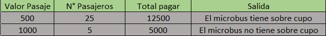

# Tabla de verificacion

## Algoritmo que lea el valor del pasaje y el número de pasajeros que abordarán un microbús

### 1. Desarrolle un algoritmo que lea el valor del `pasaje` y el `número de pasajeros` que abordarán un microbús. Calcular el valor total a pagar. Además, imprima un mensaje que diga si tiene sobre cupo o no. Tenga en cuenta que a un microbús le caben 20 pasajeros 

- `Tabla de verificacion`

