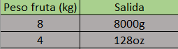

# Tabla de verificacion

## Calcular el peso equivalente en Gramos de una fruta que tiene un peso no conocido en Kilogramos, sólo si el peso sobrepasa los 5 kilogramos, de lo contrario calcular el equivalente en onzas. 16 onzas son una libra. 2 libras son 1 kilogramo. Un kilogramo son 1000 gramos.

- `Tabla de verificacion`

