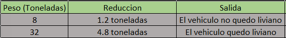

# Tabla de verificacion

## El peso de un vehículo (en toneladas) se redujo en un 15% luego de hacerle unas reparaciones. Se pide calcular el peso actual luego de la reducción. Por último se pide calcular el equivalente en kilogramos y en gramos de ese peso actual. Si la reducción es mayor a 3½ toneladas imprima un mensaje “El vehículo quedó liviano”.

- `Tabla de verificacion`

