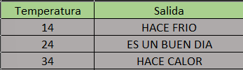

# Tabla de verificacion

## Leer la `temperatura` de un día (en grados centígrados). Imprimir un mensaje `HACE FRIO` si la temperatura es menor a 23°C, imprima “ES UN `BUEN DÍA` si la temperatura es mayor e igual que 23°C e inferiorB a 30°C. En caso que la temperatura sea igual o superior a 30°C imprima `HACE CALOR`

- `Tabla de verificacion`

