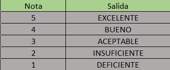

# Tabla de verificacion

## Leer la `nota` de un estudiante (en números enteros) e imprimir su `equivalente en letras` sabiendo que si la nota es 5 su equivalente es EXCELENTE, 4 es BUENO, 3 es ACEPTABLE, 2 INSUFICIENTE y 1 DEFICIENTE.

- `Tabla de verificacion`

