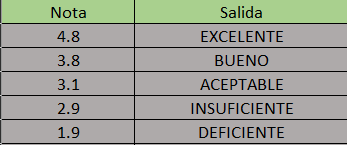

# Tabla de verificacion

## Desarrollar el mismo ejercicio anterior pero leyendo una `nota` con sus decimales y teniendo en cuenta que si la nota es `mayor o igual que 4.6 es EXCELENTE, si la nota está entre 3.6 y 4.5 es BUENO, si la nota está entre 3.0 y 3.5 es ACEPTABLE, si la nota mayor o igual que 2.0 y menor que 3.0 es INSUFICIENTE y si la nota es menor a 2.0 la nota en letras es DEFICIENTE`.

- `Tabla de verificacion`

