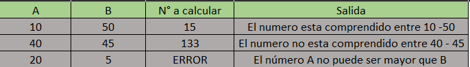

# Tabla de verificacion

## El mismo ejercicio anterior, pero ahora el rango esta entre `A`y `B`, deben tener en cuenta que si A es mayor que B, el programa debe enviar un error.

- `Tabla de verificacion`

