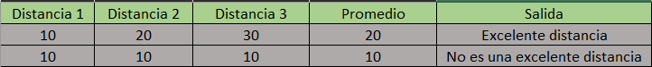

# Tabla de verificacion

## Un atleta recorre tres `distancias diferentes` en `tres competiciones distintas`. Calcular e imprimir la distancia promedio. Imprima “Excelente distancia” si el promedio es mayor a 12 kilómetros.

- `Tabla de verificacion`

