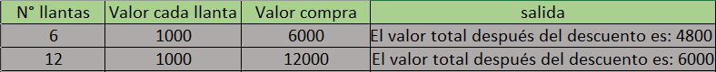

# Tabla de verificacion

## En un montallantas se ofrece un descuento del 20% sobre el valor de cada llanta si el número de llantas no supera las 10, de lo contrario tiene un descuento del 50%. Se pide desarrollar un algoritmo que lea el ``número de llantas`` y el ``valor de cada llanta``. Calcular el ``valor de la compra y el valor total`` después del descuento.

- `Tabla de verificacion`

