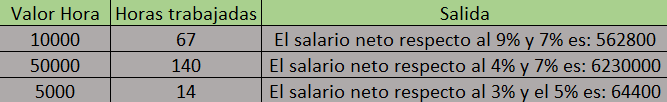

# Tabla de verificacion

## Calcular el salario neto de un empleado sabiendo que se le hace una retención del 3% para pensión y 5% para salud si su salario básico no llega a los $400.000, si este es mayor a $800.000 los porcentajes serán del 4% para pensión y 7% para salud; en caso contrario los porcentajes serán 9% y 7% respectivamente. Se debe leer el valor de cada hora y el número de horas trabajadas por el empleado

- `Tabla de verificacion`

